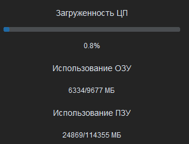
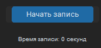
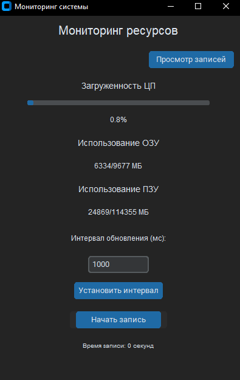
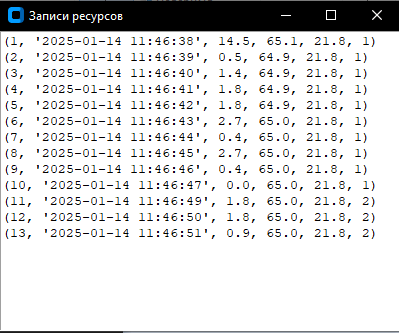
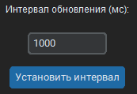
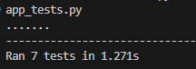

# Resource Monitor App

## Описание

Resource Monitor App — это приложение на Python для мониторинга системных ресурсов, таких как загрузка процессора, использование оперативной памяти и дискового пространства. Приложение позволяет пользователям записывать данные о ресурсах в базу данных SQLite и просматривать их через удобный интерфейс.

## Функции

- **Отображение текущей загрузки процессора, использования оперативной памяти и дискового пространства.**
  

- **Возможность записи данных о ресурсах в базу данных.**
  

- **Предоставление отдельного окна для просмотра записанных данных.**
  
  

- **Настройка интервала обновления данных.**
  

## Установка

1. Убедитесь, что у вас установлен Python 3.x.
2. Установите необходимые библиотеки, выполнив следующую команду:

   ```bash
   pip install -r requirements.txt
3. Скачайте или клонируйте репозиторий с кодом приложения.

## Запуск приложения

Для запуска приложения выполните следующую команду в терминале:
    ```bash
    python app.py

## Инструкции по использованию

1. При запуске приложения вы увидите интерфейс с текущими показателями ресурсов.
2. Вы можете установить интервал обновления данных, введя значение в миллисекундах и нажав кнопку "Установить интервал".
3. Для начала записи данных нажмите кнопку "Начать запись". Запись будет продолжаться до тех пор, пока вы не нажмете кнопку "Остановить запись".
4. Чтобы просмотреть записанные данные, нажмите кнопку "Просмотр записей".

## Структура базы данных

Приложение использует SQLite для хранения данных о ресурсах. Таблица resource_usage имеет следующую структуру:

- id: Уникальный идентификатор записи (INTEGER, PRIMARY KEY).
- timestamp: Время записи (TEXT).
- cpu_usage: Загрузка процессора в процентах (REAL).
- ram_usage: Использование оперативной памяти в процентах (REAL).
- disk_usage: Использование дискового пространства в процентах (REAL).
- record_number: Номер текущей записи (INTEGER).

## Тестирование

Для тестирования приложения используются модульные тесты, написанные с использованием библиотеки unittest. Тесты находятся в файле app_tests.py и проверяют основные функции приложения из app.py, такие как инициализация, работа с базой данных, запись и остановка записи, а также просмотр записей.
 
## Запуск тестов

1. Убедитесь, что у вас установлены все зависимости, указанные в requirements.txt.
2. Запустите тесты с помощью следующей команды:
     ```bash
     python -m unittest app_tests.py
